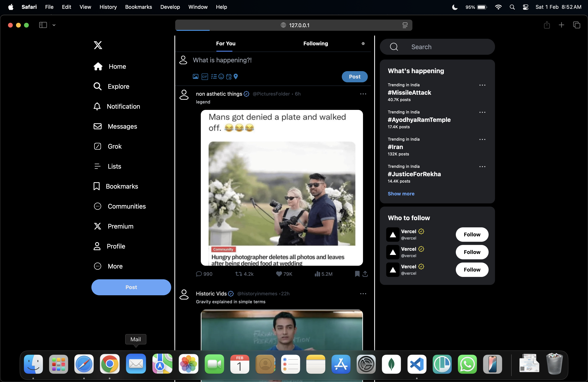

# 🐦 Twitter Clone

A simple frontend Twitter clone built using **Tailwind CSS**. This is my first project with Tailwind, and it replicates Twitter's dark-themed UI. It does **not** include media queries or responsiveness.

## 📸 Preview  
  
*(Replace with your actual screenshot path if needed.)*

## 🚀 Features
- **Dark theme UI** similar to Twitter  
- **Basic layout** with a sidebar, main feed, and right sidebar  
- **Post input box** and trending topics section  
- **Follow suggestions** section  

## 🛠️ Tech Stack
- **HTML**  
- **Tailwind CSS**  

## ⚡ How to Run
1. Clone the repository:  
   ```bash
   git clone https://github.com/Priyanshu0714/twitterClone-tailwind.git
